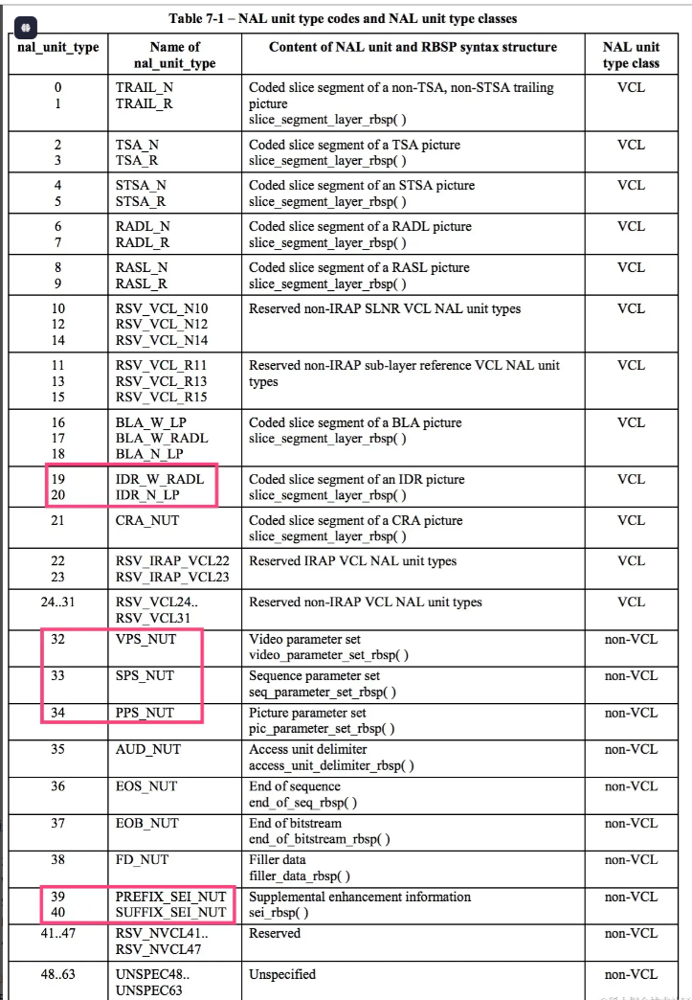

# Video Compression Standards for Embedded Camera Systems

## A Technical Whitepaper on H.264 (AVC) and H.265 (HEVC)

Version: 1.0  
Date: 01-2026  
Audience: Embedded engineers, camera architects, firmware developers

---

## 1. Introduction

Video compression is a core component of modern **embedded camera systems**, enabling real-time video transmission and storage under constrained **bandwidth, storage, and power** conditions.

Two dominant international standards are:

* **H.264 / AVC (Advanced Video Coding)**
* **H.265 / HEVC (High Efficiency Video Coding)**

This document provides:

* Core concepts of both codecs
* Technical comparison
* Advantages & limitations
* Standards and RFC references
* Practical considerations for embedded camera platforms

---

## 2. Video Codec Fundamentals

### 2.1 What is a Video Codec?

A **video codec** is a method to:

* Compress raw video data for transmission/storage
* Decompress encoded video for playback

Primary goals:

* Reduce bitrate
* Maintain acceptable visual quality
* Enable real-time processing on limited hardware

Raw video example (uncompressed):

```
1920 × 1080 × 8bit × 3 × 30fps ≈ 1.49 Gbps
```

→ **Not feasible** without compression.

---

### 2.2 Block-Based Hybrid Video Coding Model

Both H.264 and H.265 are based on the **hybrid block-based coding architecture**:


Main components:

1. Block partitioning
2. Prediction (intra / inter)
3. Transform & quantization
4. Entropy coding
5. Loop filters

---

## 3. H.264 / AVC Overview

### 3.1 Standard Definition

* Standard name: **ITU-T H.264 / ISO/IEC 14496-10**
* First published: 2003
* Widely deployed in IP cameras, CCTV, streaming

---

### 3.2 Key Characteristics

* Macroblock size: **16×16**
* Prediction types:

  * Intra (spatial)
  * Inter (temporal, motion compensation)
* Entropy coding:

  * CAVLC (baseline)
  * CABAC (main/high)


---

### 3.3 Profiles Commonly Used in Cameras

| Profile  | Use case                     |
| -------- | ---------------------------- |
| Baseline | Low-end MCU, low latency     |
| Main     | Consumer IP cameras          |
| High     | High-quality recording / NVR |

---

### 3.4 Advantages

* Mature ecosystem
* Low hardware complexity
* Broad hardware decoder support
* Stable real-time performance

---

### 3.5 Limitations

* Lower compression efficiency
* Higher bitrate at high resolutions
* Less optimal for 4K+ video

---

## 4. H.265 / HEVC Overview

### 4.1 Standard Definition

* Standard name: **ITU-T H.265 / ISO/IEC 23008-2**
* Published: 2013
* Designed for high-resolution video (4K / 8K)

---

### 4.2 Key Innovations

* Coding Tree Units (CTU): **up to 64×64**
* More flexible partitioning
* Improved motion vectors
* Advanced intra prediction
* Enhanced entropy coding


---

### 4.3 Compression Efficiency

* ~**40–50% bitrate reduction** vs H.264 at same quality
* Ideal for:

  * 4K cameras
  * Low-bandwidth networks
  * Cloud storage optimization

---

### 4.4 Advantages

* Superior compression efficiency
* Better subjective quality at low bitrate
* Designed for UHD content

---

### 4.5 Limitations

* Higher encoder complexity
* Increased CPU / hardware requirements
* Licensing concerns in some markets
* Slightly higher encoding latency

---

## 5. H.264 vs H.265 Comparison

| Feature          | H.264     | H.265              |
| ---------------- | --------- | ------------------ |
| Max block size   | 16×16     | 64×64              |
| Compression      | Baseline  | ~50% better        |
| CPU usage        | Lower     | Higher             |
| Latency          | Lower     | Slightly higher    |
| Embedded support | Excellent | Platform-dependent |
| 4K efficiency    | Moderate  | Excellent          |

---

## 6. How to Distinguish H.264 and H.265 in Practice

### 6.1 By Stream Metadata

* SDP:

```
a=rtpmap:96 H264/90000
a=rtpmap:96 H265/90000
```

### 6.2 By NAL Unit Type

* H.264 start code:
  

 H264 obtains the NALU Type by code & 0x1F,

  

```
00 00 00 01 67

  0110 0111 (0x67)
& 0001 1111 (0x1F) 
-----------
  0000 0111 (0x07) = 7(DEC) => (SPS) 
```


* H.265 NAL header structure differs (2-byte header)  
  

H265 obtains the NALU Type by (code & 0x7E) >> 1.

  


```
  0010 0110 (0x26)
& 0111 1110 (0x7E)
-----------
  0010 0110 (0x26) >> 1 = 0001 0011 (0x13) = 19 (DEC) => (IDR)


```

### 6.3 By Bitrate Observation

* Same resolution & quality:

  * H.265 bitrate ≈ 50–60% of H.264

---

## 7. RFC and Standard References

### 7.1 RTP Payload Formats

* **RFC 6184** – RTP Payload Format for H.264
  [https://datatracker.ietf.org/doc/html/rfc6184](https://datatracker.ietf.org/doc/html/rfc6184)

* **RFC 7798** – RTP Payload Format for H.265 (HEVC)
  [https://datatracker.ietf.org/doc/html/rfc7798](https://datatracker.ietf.org/doc/html/rfc7798)

---

### 7.2 SDP & Transport

* **RFC 4566** – SDP
  [https://datatracker.ietf.org/doc/html/rfc4566](https://datatracker.ietf.org/doc/html/rfc4566)

* **RFC 3550** – RTP
  [https://datatracker.ietf.org/doc/html/rfc3550](https://datatracker.ietf.org/doc/html/rfc3550)

* **RFC 2326 / RFC 7826** – RTSP
  [https://datatracker.ietf.org/doc/html/rfc7826](https://datatracker.ietf.org/doc/html/rfc7826)

---

### 7.3 Codec Standards

* ITU-T H.264
  [https://www.itu.int/rec/T-REC-H.264](https://www.itu.int/rec/T-REC-H.264)

* ITU-T H.265
  [https://www.itu.int/rec/T-REC-H.265](https://www.itu.int/rec/T-REC-H.265)

---

## 8. Embedded Camera Design Considerations

When choosing a codec:

* Available hardware encoder (ISP / VPU)
* Target resolution & framerate
* Network conditions
* Power & thermal constraints
* Decoder compatibility (NVR, mobile app)

Typical recommendation:

* **1080p / low latency** → H.264
* **4K / cloud storage / WAN** → H.265

---

## 9. Conclusion

H.264 remains the **most compatible and robust choice** for embedded cameras, while H.265 provides **significant bandwidth and storage savings** for high-resolution and next-generation systems.

A well-designed camera platform often supports **both codecs**, allowing flexible deployment across different scenarios.
